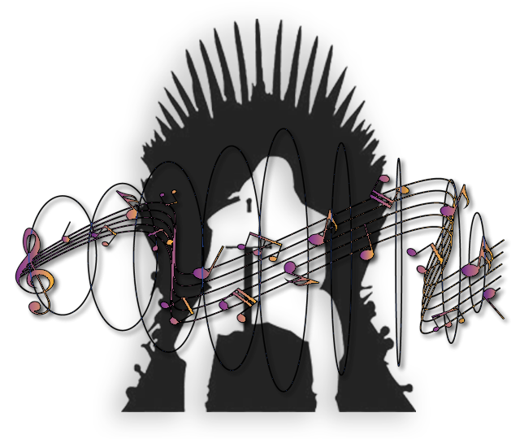

<h1 align="center">
   
  </a>
   
  Song Of Thrones
   
</h1>

<h4 align="center">A minimal sound generating coding challange</h4>
<h3 align="center">Challange Accepted</h3>

## Layout

<h3 align="center">Application FAQ</h3>

|Author         |Title          |Language       |Platform       |Size           |
| :-----------: | :-----------: | :-----------: | :-----------: | :-----------: |
|Ken Gros       |Song Of Thrones|Javascript/HTML|Google Chrome  |989b           |

<h3 align="center">Sample FAQ</h3>

|Rate           |Frequency Range|Channels       |Encoding       |File Size      |
| :-----------: | :-----------: | :-----------: | :-----------: | :-----------: |
|48000Hz        |260Hz - 390Hz  |2 Channel      |webm           |187kb          |

## Description of Technique

To start I created an array of frequencies that each correspond to a note on the treble clef transposed from sheet music for the Game Of Thrones theme song. The script starts by using AudioContext to create an Oscillator in a series of promises that are hydrated with variables for frequency, duration, and gain. At the begining and end of each promise the recorder is started and stopped and each audio chunk is pushed to an array. Once the function is complete each chunk is combined into a blob that is encoded and assigned a URL on which a click event is triggered causing the file to be automatically downloaded.

## Golf Score

  </a>

  ## How To

* Navigate to `a.html`
* Open with Chrome browser
* Press `play` button
* Once the audio has finished playing the app will create an automatic download in `.webm` format
* Navigate to the `Downloads` folder on your local disk
* Locate `_.webm`
* Open `_.webm` with Chrome browser
* Enjoy the audio again
